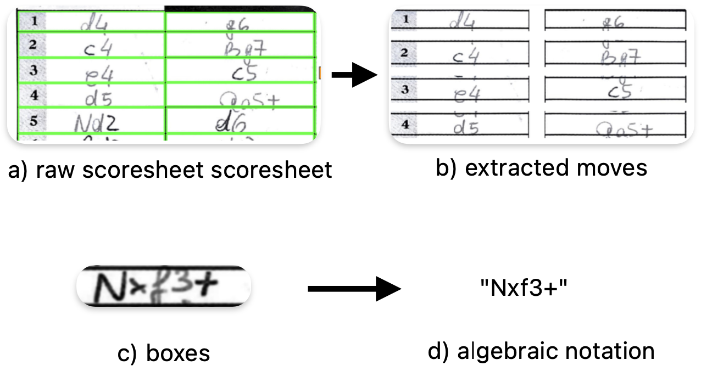

[](https://classroom.github.com/a/UDdkOEMs)
# Machine Learning for Chess Movement Recognition

This repository contains the code for the project of the course CS-433 Machine Learning at EPFL. The goal of this project is to recognize chess movements from images of handwritten scoresheets. We experimented with different models, including a CNN-BiLSTM-MLTU and HTR-Net architectures, and fine-tuned a pre-trained model (TrOCR) on our dataset.
<div style="text-align: center;">
  
</div>

## Datasets

We used two existing datasets to train and test our model:
- [Handwritten Chess Scoresheet Dataset (HCS)](https://tc11.cvc.uab.es/datasets/HCS_1/) from Owen Eicher
- [Chess Reader Public Ressources](https://www.dropbox.com/scl/fo/mfoclmkggrnv0u8wufck8/h?rlkey=v0prueklq3mqsav823voin5yi&e=3&dl=0) from spinningbytes GitHub organization

In addition, we created our own dataset by handwritting publicly available chess games, and then scanning them. These data can be found in the `data/custom_dataset` folder. Each game has its separare folder denoted by `game<game_id>` with the following structure:

```
├── game<game_id>
│   ├── game<game_id>.png     # Scan of the handwritten game                  
│   ├── moves_san.txt         # The moves played during the game
```

## Downloading the data

* The content of `2023 11 Export ChessReader Data` found in the drive provided by the professor should be placed in the `data/raw/chess_reader_data` folder. 
* The content of `HCS Dataset December 2021/extracted move boxes` (downloadable https://sites.google.com/view/chess-scoresheet-dataset/home/) should be placed in `data/raw/hcs_dataset` folder.

More informations on the scripts to process the data can be found in the [dedicated README.md](https://github.com/CS-433/ml-project-2-syc-group/blob/main/src/data/README.md)

To generate the full training and test sets, run the following commands from the root of the project: 
```bash
python src/data/existing_datasets.py
python src/data/custom_dataset.py --process --destination_path ./data/custom_dataset
python src/data/prepare_data.py
```


## Project structure 

```
├── configs                   # Configuration for the models
├── data/                     # Unprocessed datasets
│   ├── custom_dataset/       # Scanned sheets and corresponding move 
├── notebooks/                
├── results/                  
├── src/                      # Source code 
│   ├── data/                 # Scripts for loading and preprocessing datasets
│   ├── models/               
│   ├── train/                # Training and evaluation scripts
├── .env                      
├── README.md
├── requirements.txt
├── run.sh            
```

## Training

Each experiment (model training) should be represented by a config (`.yaml`) file in `configs` folder. 
The results will be saved in the folder specified in the config file (usually in the `results` folder). 

To train a model, run the following command: 
```bash
python src/train/train.py --config configs/cnn_bilstm_mltu_default.yaml
```

## Dependencies 

Install the requirements using the following command:

```bash
pip install -r requirements.txt
``` 

## Models

- The best performing CNN-BiLSTM-MLTU and HTR-Net architectures we trained are present in `results/cnn_bilstm_mltu_all_data` and  `results/htr_full_data`respectively. You can use them for inference by using `src/inference.py` script. 
- The best performing fine-tuned TrOCR model is present in https://drive.google.com/drive/u/2/folders/12I3GhCDFewbT3f5TpPIMebGkLSHleFem. 


## Results 

In this section, we present the results of our experiments and explain how to reproduce them.

- **Impact of our custom made dataset**
    The following are tables I and II of the report. They demonstrate that our custom dataset in facet improves the performence of our models. We generate them in the `notebooks/interpret_results.ipynb` notebook. All the models used in these results are stored in the `results` folder.

    To experiment training without our custom dataset, we set the argument `size_custom` to 0 in `src/data/prepare_data.py` . The command becomes:
    ```bash
    python src/data/prepare_data.py --size_custom 0
    ```

    | **Custom Dataset**      | **WITHOUT Val** | **WITHOUT Test** | **WITH Val** | **WITH Test** |
    |--------------------------|-----------------|------------------|--------------|---------------|
    | **CNN-BiLSTM-MLTU**     | 0.1581          | **0.3559**       | 0.0948       | **0.1761**    |
    | **HTR-Net**             | **0.152**       | 0.3601           | **0.091**    | 0.2021        |

    *Table 1: Model performance in terms of **CER**.*

    ---


    | **Custom Dataset**      | **WITHOUT Val** | **WITHOUT Test** | **WITH Val** | **WITH Test** |
    |--------------------------|-----------------|------------------|--------------|---------------|
    | **CNN-BiLSTM-MLTU**     | 0.3033          | **0.5506**       | **0.195**    | **0.3279**    |
    | **HTR-Net**             | **0.29**        | 0.6073           | 0.2004       | 0.3846        |

    *Table 2: Model performance in terms of **WER**.*


- **Fine tuned model** The results of the fine tuned model are the following, we generate them in the `notebooks/interpret_finetuned.ipynb` notebook. 
    | Metric | Validation Set | Test Set |
    |--------|----------------|----------|
    | CER    | 0.1044         | 0.1814   |
    | WER    | 0.2193         | 0.3482   |
